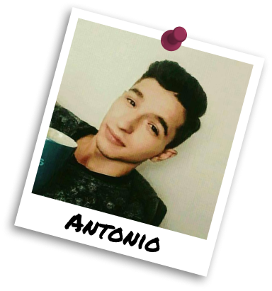

### Hello 
My name is Antonio Rafael Antunes Miranda. I'm a 24-year-old programmer from Germany.  
I'm currently learning Game and Shader development with Unity. I also like to create editor tools.

### Favorite Programming Languages

ㅤㅤㅤㅤㅤㅤㅤㅤㅤㅤㅤㅤㅤㅤㅤㅤㅤㅤㅤㅤㅤㅤㅤㅤㅤㅤㅤㅤㅤㅤㅤㅤㅤㅤㅤㅤㅤㅤㅤㅤㅤㅤㅤㅤㅤㅤㅤㅤㅤㅤㅤㅤㅤㅤㅤㅤㅤㅤ <b><^)</b>  
︵‿︵‿︵‿︵‿︵‿︵‿︵‿︵‿︵‿︵‿︵‿︵‿︵‿︵‿︵‿︵‿︵‿︵‿︵‿︵‿︵‿︵‿︵‿︵‿︵‿︵‿︵‿︵‿︵‿︵‿︵‿<b><i>(ㅤȜㅤ)</i></b>‿︵‿︵‿︵‿︵‿
